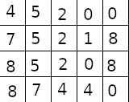

# Exam 2 for ISC_5935 Data Science meets Health Sciences, Spring 2023

The objective of this exam is to evaluate our current learning in the following topics:
*Image filters and resampling of medical image formats, basic concepts of supervised machine learning,*
*neural networks and basics of Convolutional Layers.*

## Question 1 (Image filters and resampling 6 Pts)
Use ITK to resample `data/cor.mha` into isotropic voxels of size 0.5 'spacing' units. 

What are the dimensions of the resampled image? 

## Question 2 (Supervised machine learning 10 Pts)
For each of the models  ([Model 1](Model_1.ipynb) and [Model 2](Model_2.ipynb) answer the following questions:

1. What is the model architecture?
2. What is the loss function?
3. Is the last model  in the provided training overfitting or underfitting? Why?
5. Does the last model have high bias or high variance? Why?
6. At which epoch would you select your model in the provided training?
7. What suggestions would you give to improve each model (if any)?

## Question 3 (Neural networks and data exploration 12 Pts)
Considering the data from FILE `data/diabetes.csv` containing  the publicly available Pima Indians Diabetes 
dataset from the UCI Machine Learning Repository, design a neural network that predicts the onset of diabetes.

Answer the following questions about the dataset and your proposed solution:

1. Which information is available in the dataset?
2. How many patients are in the dataset?
3. What is the percentage of patients with diabetes?
4. What is the range of values for each feature (min and max)?
5. How you will preprocess the data?
6. What architecture will you use for the neural network? (Provide information like the # of layers, # of neurons per layer, 
activation functions, etc. explain your choices)
7. What will be a suitable loss function?
8. How would you train your model? (Provide information like the # of epochs, batch size, optimizer, etc. explain your choices)

## Question 4 (CNNs 6 Pts)
Assume you have the image bellow as input and a 3x3 convolutional filter with all 1's. Please answer the following questions :

1. If you have no padding and a stride of 1, what will be the **size** of the output (rows x cols)?
2. If you have no padding and a stride of 2, what is the **size** of the output (rows x cols)?
3. If you have a padding of 1 and a stride of 1, what is the **size** of the output?
4. If we use 8 filters, padding of 'same', and stride and dilation of 1, what is the **size** of the output?
5. If we now have 3 channels in the input image and create a 2D convolutional layer in pytorch like this
`torch.nn.Conv2d(in_channels=3, out_channels=2, kernel_size=3, stride=1, padding=1 padding_mode='zeros')`
, what is the **size** of the output?

## Question 5 (Extra 10 Pts)
Implement the proposed architecture in Question 3 and train it. Evaluate the model and report the results.